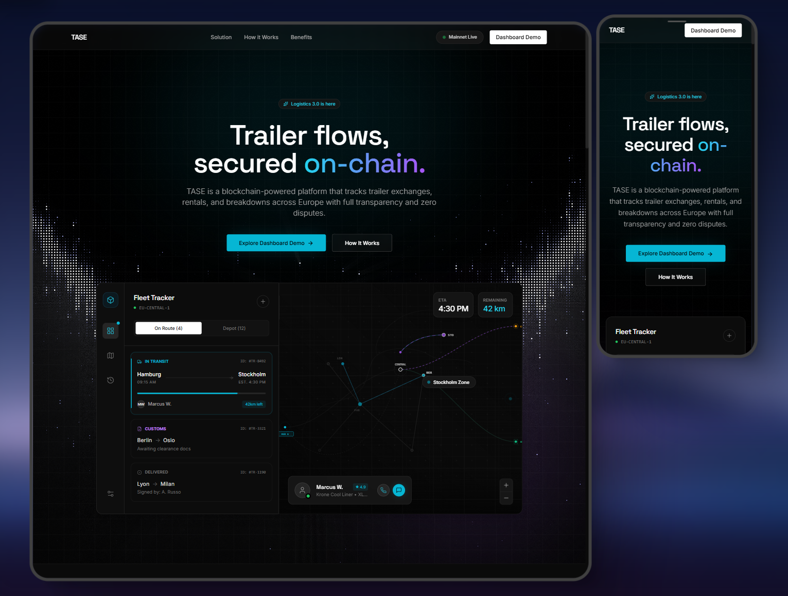

# Tase
### Web3 Logistics Infrastructure — Trailer Operations On-Chain
TASE — Web3 logistics platform prototype for tracking trailer operations (handover, rental, incidents) on-chain with transparency, auditability, and zero disputes.

# Demo 

https://johntrumanburbank-afk.github.io/Tase/

## 🧭 Aperçu

La logistique européenne repose encore sur :
- des fichiers Excel,
- des échanges informels,
- des responsabilités floues,
- et des litiges coûteux.

**TASE** ne cherche pas à remplacer les TMS existants.  
La plateforme fournit une **couche de confiance universelle**, interopérable, permettant à tous les acteurs du transport de **partager une vérité commune** sur l’état et l’usage des remorques.

---

## 🌍 Vision

La logistique moderne est :
- distribuée,
- multi-acteurs,
- transfrontalière.

Mais la **confiance**, elle, reste fragmentée.

TASE réconcilie :

- traçabilité opérationnelle,
- automatisation contractuelle,
- transparence inter-entreprises,
- responsabilité partagée.

---

## 🧩 Fonctionnalités clés

### 🔹 Traçabilité des remorques
- Suivi du cycle de vie des remorques
- États horodatés :  
  *en transit, en dépôt, louée, incident, restituée*
- Historique immuable des événements

### 🔹 Échanges & locations on-chain
- Enregistrement des transferts de responsabilité
- Locations encadrées par smart contracts
- Règlement automatique à la restitution

### 🔹 Incidents & litiges
- Déclaration d’incidents traçable
- Journal d’état avant / après usage
- Réduction des conflits grâce à l’auditabilité

### 🔹 Tableau de bord temps réel
- Visualisation européenne des flux
- États des actifs en direct
- Interfaces pensées pour dispatchers et exploitants

---

## 🏗️ Cas d’usage

- Mutualisation de flottes de remorques
- Location courte ou longue durée
- Tractionnaires & réseaux européens
- Gestion des pannes et réparations
- Audit, assurance et conformité

---

## ⚖️ Cadre & positionnement

TASE :

❌ n’est **pas** un TMS  
❌ n’est **pas** un ERP  
❌ n’est **pas** un outil de géolocalisation GPS  

TASE est :

✅ une **infrastructure de confiance logistique**  
✅ une **couche d’audit et de responsabilité**  
✅ un **registre d’événements on-chain**, interopérable  

Les données opérationnelles restent la propriété des acteurs.

---

## 🛠️ Stack technique (prévisionnelle)

> Cette section évoluera avec le projet.

- **Frontend** : React / Next.js / Tailwind
- **Backend** : Node.js / API sécurisée
- **Blockchain** : EVM compatible (smart contracts)
- **Base de données** : PostgreSQL / Indexers
- **Authentification** : OAuth / Wallet-based auth
- **Infrastructure** : Cloud sécurisé
- **Design system** : UI orientée lisibilité & opérations terrain

---

## 🚧 Statut du projet

🔧 **Prototype / Proof of Concept**

- Vision produit validée
- Design UX & dashboard interactif
- Exploration juridique & opérationnelle
- Tests utilisateurs à venir

---

## 🤝 Contribuer

Les contributions sont bienvenues :

- feedback produit
- UX / UI
- architecture Web3
- interopérabilité logistique
- discussions stratégiques

👉 Ouvrez une **issue** ou une **discussion**.

---

## 📬 Contact

Projet initié par **TASE**  
📩 Contact : à compléter  
🔗 Site / LinkedIn : Ismaël BERNARD

---

> **La logistique repose sur la confiance.  
> TASE la rend vérifiable.**

---

EN 

# TASE
### Web3 Logistics Infrastructure — Trailer Operations On-Chain

> **Assets are physical.  
> Trust must be digital.**

**TASE** is a **Web3-native logistics platform** designed to secure and trace **trailer flows, rentals, handovers, and incidents** across Europe using an **on-chain infrastructure**.

🌐 **Demo**  
👉 https://johntrumanburbank-afk.github.io/tase/

---

## 🧭 Overview

European logistics still relies heavily on:
- spreadsheets,
- informal communication,
- unclear responsibilities,
- and costly disputes.

**TASE** does not aim to replace existing TMS solutions.  
Instead, it provides a **universal trust layer** that enables all transport stakeholders to **share a single source of truth** regarding trailer usage and condition.

---

## 🌍 Vision

Modern logistics is:
- distributed,
- multi-stakeholder,
- cross-border.

Yet **trust remains fragmented**.

TASE bridges:
- operational traceability,
- contract automation,
- inter-company transparency,
- shared responsibility.

---

## 🧩 Key Features

### 🔹 Trailer Traceability
- Full trailer lifecycle tracking
- Timestamped states:  
  *in transit, at depot, rented, incident, returned*
- Immutable event history

### 🔹 On-chain Transfers & Rentals
- Responsibility handovers recorded on-chain
- Smart-contract-based rental agreements
- Automated settlement upon return

### 🔹 Incidents & Disputes
- Traceable incident reporting
- Pre- and post-usage condition logs
- Reduced disputes through auditability

### 🔹 Real-Time Dashboard
- Europe-wide flow visualization
- Live asset status
- Interfaces designed for dispatchers and operators

---

## 🏗️ Use Cases

- Shared trailer fleets
- Short- and long-term rentals
- Cross-border carrier networks
- Breakdown & maintenance tracking
- Audit, insurance, and compliance

---

## ⚖️ Scope & Positioning

TASE:

❌ is **not** a TMS  
❌ is **not** an ERP  
❌ is **not** a GPS tracking tool  

TASE is:

✅ a **logistics trust infrastructure**  
✅ an **audit & responsibility layer**  
✅ an **interoperable on-chain event registry**

Operational data remains owned by its stakeholders.

---

## 🛠️ Technical Stack (planned)

> This section will evolve with the project.

- **Frontend**: React / Next.js / Tailwind
- **Backend**: Node.js / Secure API
- **Blockchain**: EVM-compatible (smart contracts)
- **Database**: PostgreSQL / Indexers
- **Authentication**: OAuth / Wallet-based auth
- **Infrastructure**: Secure cloud environment
- **Design System**: UI focused on clarity & field operations

---

## 🚧 Project Status

🔧 **Prototype / Proof of Concept**

- Product vision validated
- Interactive UX & dashboard design
- Legal & operational exploration
- User testing planned

---

## 🤝 Contributing

Contributions are welcome:

- product feedback
- UX / UI
- Web3 architecture
- logistics interoperability
- strategic discussions

👉 Open an **issue** or start a **discussion**.

---

## 📬 Contact

Project initiated by **TASE**  
📩 Contact: to be defined  
🔗 Website / LinkedIn: Ismaël BERNARD

---

> **Logistics runs on trust.  
> TASE makes it verifiable.**

---

### 🧑‍💻 Credits
Prototype designed and built by **I. Bernard**

### 🧑‍💻 Crédits
Prototype conçu et réalisé par **I. Bernard**
